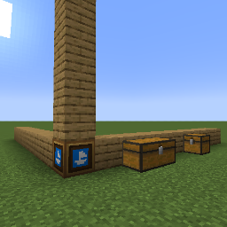

# Schematic Builder

Schematic builder can build VMod schematics.

To use:
* Place builder somewhere
* Add extensions (by default it's oak planks, but you can change it with datapack) to it (up/down, left/right, front/back). 
Length of the extensions will determine how big of an object it can build.
* Place containers directly next to extensions (chests, shulkers, etc)

Schematic builder will use blocks from containers to build schematic.

You can also trigger build with redstone signal.